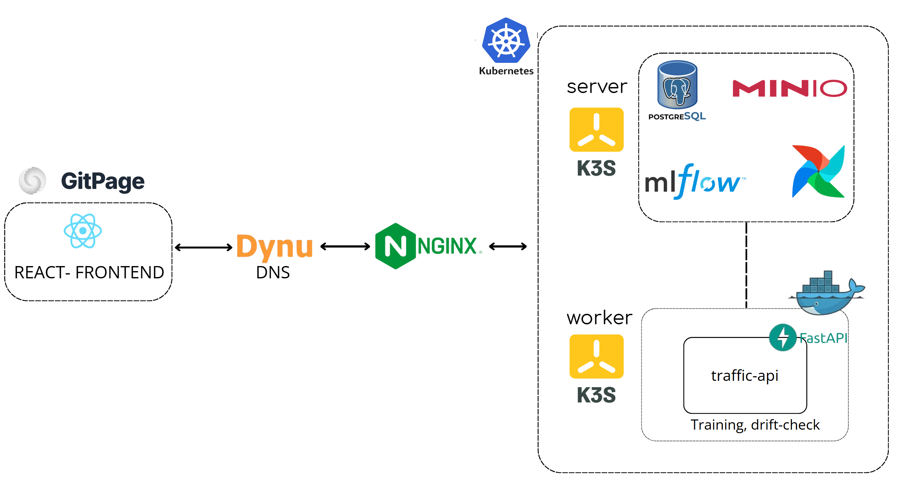
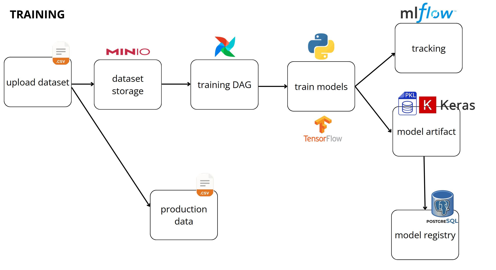

# Adaptive MLOps Traffic Forecasting Platform

An end-to-end MLOps system for traffic volume forecasting, combining a FastAPI backend, a React dashboard, training and retraining workflows, model tracking, monitoring, and containerized infrastructure.

## Overview

This platform is built to support traffic forecasting by region and by time horizon while automating the major steps in the model lifecycle:

- versioned dataset management
- model training and evaluation across multiple candidates
- metric, artifact, and model version tracking
- API-based inference for the web application
- drift monitoring and retraining triggers

## System Architecture



## Training Flow



## Key Features

- Forecast traffic volume with multiple modeling approaches, including tree-based models and deep learning.
- Provide a web dashboard for predictions, regions, datasets, models, drift, and user management.
- Expose a FastAPI backend for inference, data operations, and platform services.
- Orchestrate training and retraining with Apache Airflow.
- Track experiments, artifacts, and model lineage with MLflow.
- Use PostgreSQL and MinIO for metadata, artifact storage, and operational data.
- Validate core behavior with tests for inference, lifecycle, dataset validation, and model selection.

## Tech Stack

- Backend: FastAPI, SQLAlchemy, Alembic, Pydantic
- Machine Learning: scikit-learn, XGBoost, LightGBM, joblib, MLflow
- Frontend: React, Vite
- Orchestration: Apache Airflow
- Storage: PostgreSQL, MinIO
- Infrastructure: Docker, Docker Compose

## Repository Structure

```text
.
|-- app.py                         Compatibility entrypoint for Uvicorn and Docker
|-- backend/                       FastAPI application package
|   |-- app/
|   |   |-- api/                   API routers and endpoints
|   |   |-- core/                  Configuration, middleware, and error handling
|   |   |-- db/                    Database session and persistence helpers
|   |   |-- legacy/                Backward-compatible routes
|   |   `-- services/              Business logic and domain services
|   `-- __init__.py
|-- frontend/                      React + Vite dashboard
|   |-- public/
|   `-- src/
|-- src/                           Shared ML code for training, inference, and preprocessing
|   |-- best_model_selection.py
|   |-- drift.py
|   |-- inference.py
|   |-- preprocess.py
|   |-- time_series_training.py
|   `-- ...
|-- airflow/
|   `-- dags/                      Airflow DAG definitions
|-- alembic/                       Database migration environment
|-- data/                          Raw and processed datasets
|-- data_versions/                 Versioned dataset snapshots and logs
|-- docs/                          Documentation site and phase-specific guides
|-- infra/                         Deployment, backend, and platform infrastructure assets
|-- k8s/                           Kubernetes manifests and overlays
|-- monitoring/                    Drift history and monitoring state
|-- models/                        Persisted model artifacts and metadata
|-- mlruns/                        MLflow run artifacts and tracking data
|-- results/                       Training outputs, predictions, and evaluation reports
|-- scripts/                       Utility scripts for data and training workflows
|-- tests/                         Automated tests for core behaviors
|-- Dockerfile                     Backend container image
|-- docker-compose.yml             Full local stack orchestration
|-- README.md                      Project overview and setup guide
`-- requirements.txt               Python dependencies
```

## Quick Start with Docker

1. Make sure Docker and Docker Compose are installed.
2. Start the full stack:

```bash
docker compose up --build
```

3. Open the services:

- Web app: http://localhost:5173
- API: http://localhost:8000
- API docs: http://localhost:8000/docs
- MLflow: http://localhost:5000
- Airflow: http://localhost:8080
- MinIO console: http://localhost:9001

## Local Development

### Backend

```bash
python -m venv .venv
.venv\Scripts\activate
pip install -r requirements.txt
uvicorn app:app --host 0.0.0.0 --port 8000 --reload
```

### Frontend

```bash
cd frontend
npm install
npm run dev
```

## Training and Retraining

Training logic lives in `src/` and is orchestrated through the Airflow workflows. When new data or drift signals appear, the retraining job can evaluate candidate models and promote the best one according to the configured rules.

Relevant entry points include:

- `retrain_job.py`
- `src/train.py`
- `src/time_series_training.py`
- `airflow/dags/`
